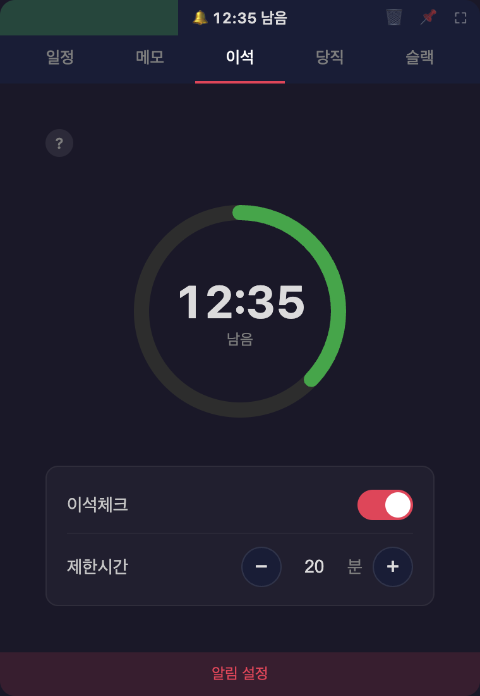
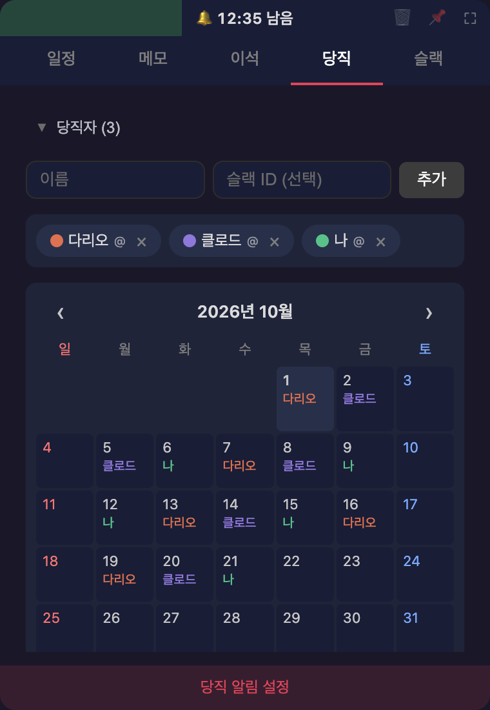

# Todo Alarm

맥북용 할일 & 알림 데스크탑 앱

메뉴 막대 아이콘을 누르면 작은 창이 뜨고, 일정과 메모를 적어 두면 시간 맞춰 알려줍니다.

| 일정 | 메모 |
| :---: | :---: |
|  |  |
| 날짜와 시간을 정해 두면 그때 알림이 옵니다. 매월 1일처럼 반복되는 일정도 등록할 수 있습니다. | 떠오른 생각을 바로 적어 둡니다. 끌어서 순서를 바꿀 수 있습니다. |
| **이석** | **당직** |
|  |  |
| 키보드와 마우스를 오래 안 만지면 알려줍니다. 점심시간과 퇴근 뒤는 빼고 셀 수 있습니다. | 달력에 당직자를 끌어다 놓으면 그날 정해 둔 시각에 슬랙으로 알려줍니다. |

## 다운로드

[최신 버전 다운로드](https://github.com/bedcoding/todo-alarm/releases/latest)

> Apple Silicon(M1/M2/M3/M4) Mac 전용

## 설치 방법

1. `Todo-Alarm-x.x.x-mac-arm64.zip` 다운로드
2. 압축 해제
3. `Todo Alarm.app`을 Applications 폴더로 이동
4. 처음 실행 시 우클릭 → 열기 (보안 경고 우회)
5. 처음 실행하면 로그인 항목에 등록되어 재부팅한 뒤에도 자동으로 켜집니다.
   원하지 않으면 메뉴 막대 아이콘을 우클릭해서 **로그인 시 자동 실행**을 해제하세요.

## 주요 기능

- 일정 등록 및 알림
- 메모
- 이석 타이머
- 슬랙 연동
